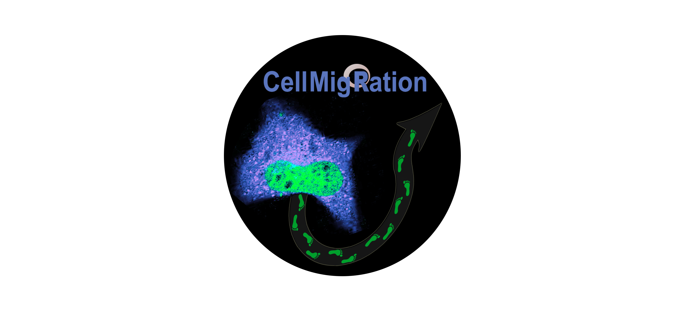

<!-- README.md is generated from README.Rmd. Please edit that file -->

# CellMigRation



<!-- badges: start -->

<!-- badges: end -->

An R package for tracking cells and analyzing their trajectories.

## Installation

You can install the current version of CellMigRation from
[GitHub](https://github.com/) with:

``` r
# install.packages("devtools")
devtools::install_github("ocbe-uio/CellMigRation")
```

## Example

Example usage:

``` r
> library(CellMigRation)
> data(Trajectory_dataset)
> rmDF=Trajectory_dataset[1:2000,]
> rmTD <- CellMig(rmDF)
> rmTD <- rmPreProcessing(rmTD,FrameN=100)
This dataset contains:  19 Cells 
The desired number of steps:  100 
The maximum number of steps:  115 
Only:  18  cells were selected 
All the tracks of the selected cells are adjusted to have only  100  steps 
```
